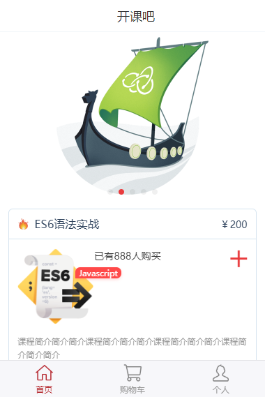

# docker

## 在本地window运行看

#### 启动后台服务器
1. 安装mongo，创建名为 `taro` 的数据库
2. 修改 `/backend/models/conf.js` 的配置，链接win本地数据库`mongodb://127.0.0.1:27017`
3. 启动后台服务 `node server.js`，端口3000

#### 启动前端服务
1. 前端是用taro开发，一直启动不成功，就先用里面dist编译好的代码用
2. 前端请求后台接口，是用`/api/xxx`的方式请求的。所以在前端nginx上做好代理，指到3000端口上
3. 商品图片是放在 `/static` 里面，所以nginx再做个代理，把 `jpg/png/jpeg` 等格式映射到 `/static` 文件里面
4. 启动服务
- 如果用了http-server工具，可以执行命令`http-server --proxy http://127.0.0.1:3000`来看前端实现的效果
- 如果win上有nginx，可以用下面配置
```conf
server {
    listen       80;

    location /api/ {
        proxy_pass     http://127.0.0.1:3000/api/;
        proxy_redirect     off;
        proxy_set_header   Host             $host;
        proxy_set_header   X-Real-IP        $remote_addr;
        proxy_set_header   X-Forwarded-For  $proxy_add_x_forwarded_for;
    }
  
    location / {
        root  E:/workspace/项目路径/frontend/dist;
        index  index.html index.htm;
    }

    location ~ \.(gif|jpg|png)$ {
        root E:/workspace/项目路径/static;
        index index.html index.htm;
    }
}
```




## 代码上传到linux服务器
把整个项目上传到centos服务器的 `/root/svr/docker-cli` 路径下（node_modules）的都不要删除，其他原封不动都上传上去。


## 编写docker任务
#### 1. 前端nginx配置
把nginx的配置保存到`/nginx/conf.d/default.conf`，内容如下
```conf
server {
    listen       80;
  
    location / {
        root  /var/www/html;
        index  index.html index.htm;
    }

    location ~ \.(gif|jpg|png)$ {
        root /static;
        index index.html index.htm;
    }
}
```

#### 2. 编写前端docker-compose.yml
在`/docker-compose.yml`编写nginx的docker任务，内容如下
```yml
version: '3.1'
services:
  nginx:
    restart: always
    image: nginx
    ports:
      - 8091:80
    volumes:
      - ./nginx/conf.d/:/etc/nginx/conf.d
      - ./frontend/dist:/var/www/html/
      - ./static/:/static/
```

在linux上执行
```shell
docker-compose up
```
然后在浏览器访问`http://服务器IP:8091/`即可成功


#### 3. 编写后台pm2任务
linux上是用pm2来启动后台node的，接下来编写pm2的任务。

在`/backend/process.yml`编写，代码如下:
```yml
apps: 
  - script: server.js
    instances: 2
    watch: true
    env: 
      NODE_ENV: production
```
这个是给pm2的

#### 4. 编写让docker忽略node_module
编写`/backend/.dockerignore`，让docker忽略掉node_modules这个文件夹，在docker里面是通过`npm install`安装的。

内容如下:
```
node_modules
```

#### 5. 编写后台Dokcerfile
编写构建镜像`/backend/Dockerfile`，内容如下
```
FROM keymetrics/pm2:latest-alpine
WORKDIR /usr/src/app
ADD . /usr/src/app
RUN npm config set registry https://registry.npm.taobao.org/ && \
    npm i
EXPOSE 3000
CMD ["pm2-docker", "start", "process.yml"]
```

修改mongo的链接方式，将 `/backend/models/conf.js` 的修改为
```js
url: "mongodb://mongo:27017"
```


#### 6. 在前端nginx做后台接口代理
修改 `/nginx/conf.d/default.conf` 的nginx配置，新增一个后台api的代理
```
location /api/ {
    proxy_pass     http://app-pm2:3000/api/;
    proxy_redirect     off;
    proxy_set_header   Host             $host;
    proxy_set_header   X-Real-IP        $remote_addr;
    proxy_set_header   X-Forwarded-For  $proxy_add_x_forwarded_for;
}
```


#### 7. 编写后台的docker-compose任务
在 `/docker-compose.yml` 新增代码如下:
```
app-pm2:
  container_name: app-pm2
  build: ./backend
  ports: 
    - 3000:3000
mongo:
  image: mongo
  restart: always
  ports: 
    - 27017:27017
```

## 运行docker-compose
在linux上执行
```shell
docker-compose up
```
即可在浏览器访问`http://59.110.21.75:8091/`

完成整个部署